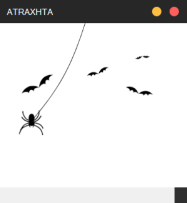
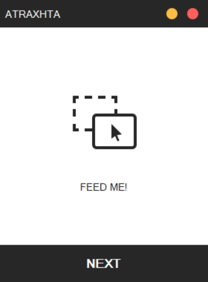
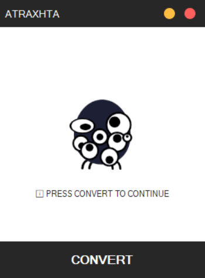
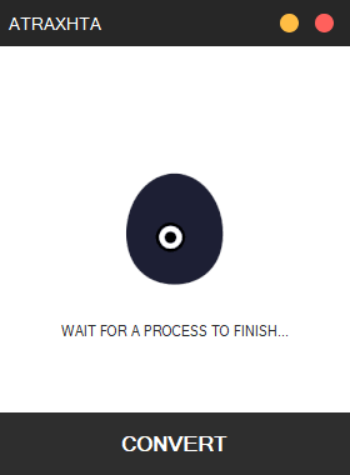
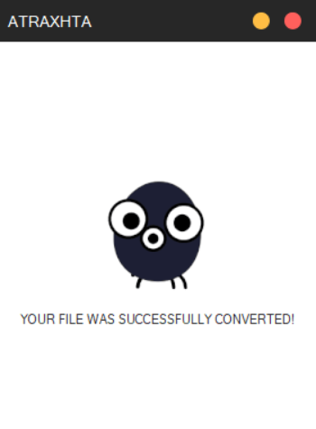

### Welcome to ATRAXHTA version 1.54

This tool will convert your EXE payload to HTA. it's very simple to use.

### ❗ What is this ?

ATRAXHTA is a tool that automate procedures during converting any EXE to HTA extension and it also and make's your payload persistent. This tool was made for Windows users.

Video Proof: 

Scan Results: https://www.kleenscan.com/scan_result/72462f2efcaf34c637ca0837e522701a026987022c4f206124d5329e72fd6575

### ⚙️ FEATURES

- Add payload to Stratup
- Compatible with Any Assembly Language
- Obfuscated HTA
- Easy to use & it doesn't need knowledge

### 📖 HOW TO INSTALL

1. Download the tool ('https://sellix.io/product/5fef4f77d952d')
2. Unzip the file
3. Open the ATRAXHTA.exe file
4. Drag & Drop your payload
5. and press CONVERT button & wait till process ends

To learn more please watch this video: 

### 📡 HOW TO UPDATE

You can check updates from our official website:
https://ctoslab.com/products/

For feature recommendation please add it on the "Issues" tab or contact us:
https://www.ctoslab.com/support/

### 💰 Donate

If you like my work, consider buying me a coffee :)

Bitcoin > 17qcsGD3FTckSqHLH4PE4XfRtcktgAZTJm

⚠️ We are not responsible on how you use this tool. 
